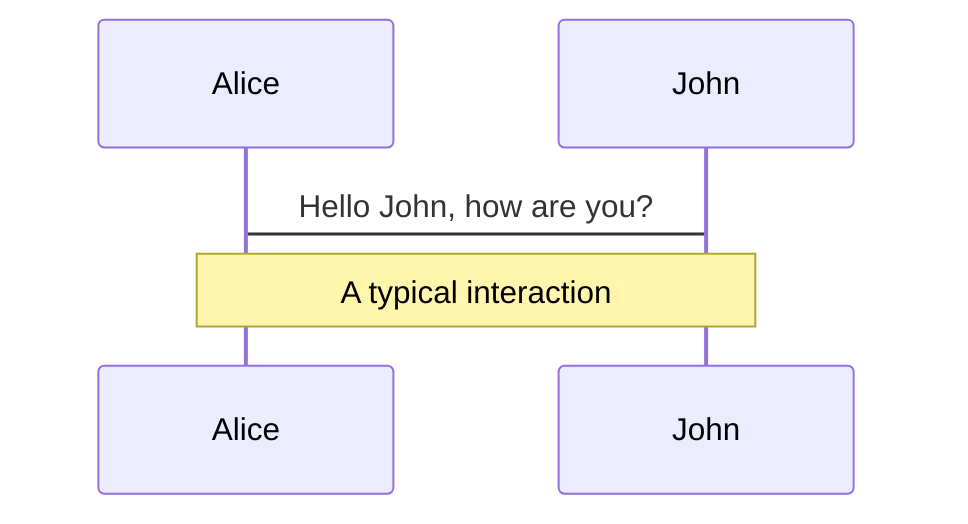
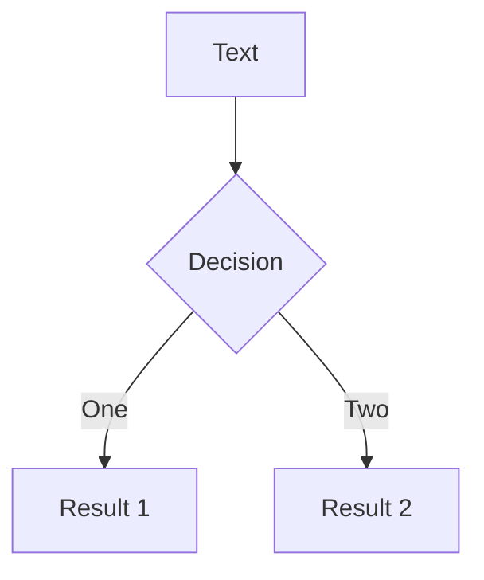
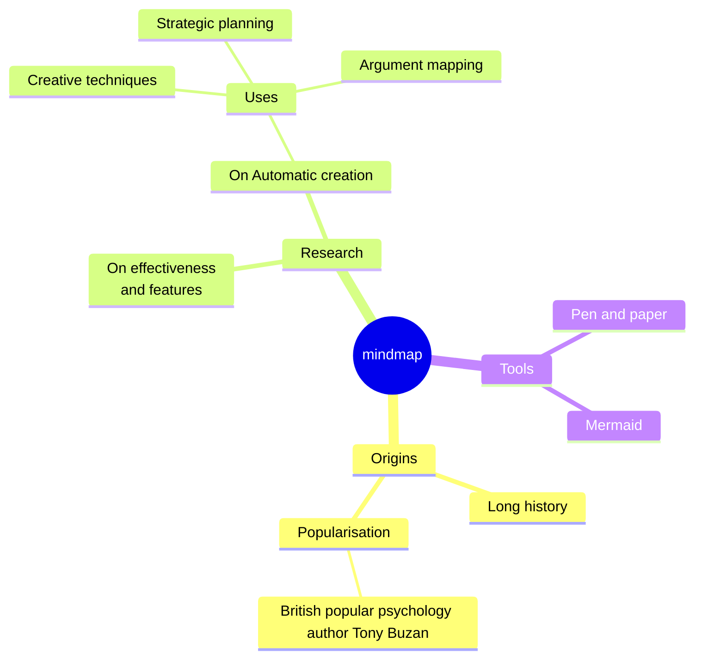

# Diagrams

You can create diagrams / graphs from textual descriptions, directly in your Markdown.

```mermaid {scale: 0.5, alt: 'A simple sequence diagram'}
sequenceDiagram
    Alice->John: Hello John, how are you?
    Note over Alice,John: A typical interaction
```

```mermaid {theme: 'neutral', scale: 0.8}
graph TD
B[Text] --> C{Decision}
C -->|One| D[Result 1]
C -->|Two| E[Result 2]
```

```mermaid
mindmap
  root((mindmap))
    Origins
      Long history
      ::icon(fa fa-book)
      Popularisation
        British popular psychology author Tony Buzan
    Research
      On effectiveness<br/>and features
      On Automatic creation
        Uses
            Creative techniques
            Strategic planning
            Argument mapping
    Tools
      Pen and paper
      Mermaid
```

Learn more: [Mermaid Diagrams](https://sli.dev/features/mermaid)